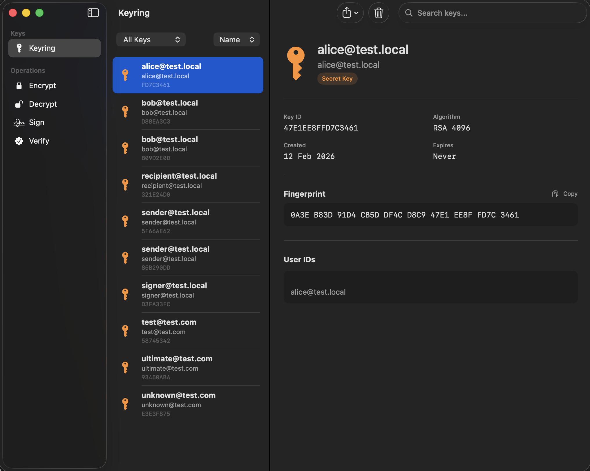

# MacPGP



A native macOS application for PGP encryption, decryption, signing, and key management built with SwiftUI.

## Features

- **Key Management** - Generate, import, export, and delete PGP keys
- **Encryption** - Encrypt messages and files for one or more recipients
- **Decryption** - Decrypt PGP-encrypted messages and files
- **Signing** - Create digital signatures with support for:
  - Cleartext signed messages (human-readable)
  - Detached signatures
  - Armored output
- **Verification** - Verify PGP signatures and extract original messages
- **Keychain Integration** - Securely store passphrases in macOS Keychain
- **ASCII Armor Support** - Import/export keys and messages in armored format
- **Session State** - Preserves input/output state across view navigation

## Finder Integration

MacPGP includes three macOS extensions that integrate directly with Finder for a seamless encryption workflow:

- **File Badges** - Encrypted files (.gpg, .asc, .pgp) display a lock badge in Finder, making it easy to identify PGP-encrypted content at a glance
- **Quick Look Previews** - Press Space on an encrypted file to see:
  - Encryption metadata (algorithm, recipients, file size)
  - Decrypt preview button with secure passphrase prompt
  - In-place content preview (text and images) without saving to disk
- **Custom Thumbnails** - Visual distinction for encrypted files:
  - Binary files (.gpg, .pgp): Blue gradient with lock icon
  - ASCII armored files (.asc): Green gradient with document-lock icon
- **Context Menu Actions** - Right-click any file for quick access:
  - "Encrypt with MacPGP" - Opens main app with recipient picker
  - "Decrypt with MacPGP" - Opens main app with passphrase prompt

**Enabling Extensions:**
After first launch, enable the extensions in System Settings → Privacy & Security → Extensions → Finder Extensions / Quick Look / Thumbnails.

## Requirements

- macOS 15.0+
- Xcode 16.0+

## Installation

1. Clone the repository:
   ```bash
   git clone https://github.com/thalesmms/MacPGP.git
   cd MacPGP
   ```

2. Open the Xcode project:
   ```bash
   open MacPGP/MacPGP.xcodeproj
   ```

3. Build and run (⌘R)

## Dependencies

- [ObjectivePGP](https://github.com/krzyzanowskim/ObjectivePGP) - OpenPGP implementation for iOS and macOS

## Project Structure

```
MacPGP/
├── Core/
│   ├── Models/          # Data models (PGPKeyModel, KeyAlgorithm, etc.)
│   ├── Services/        # Business logic (KeyringService, EncryptionService, SigningService, SessionStateManager)
│   ├── Security/        # Keychain integration
│   └── Persistence/     # Key storage and preferences
├── Features/
│   ├── Keyring/         # Key list and management UI
│   ├── KeyDetails/      # Key details and fingerprint views
│   ├── KeyGeneration/   # Key generation wizard
│   ├── Encryption/      # Encrypt and decrypt views
│   ├── Signing/         # Sign and verify views
│   └── Settings/        # App preferences
├── Navigation/          # App navigation (sidebar, content view)
└── Shared/
    ├── Components/      # Reusable UI components (CopyableText, PassphraseField)
    └── Extensions/      # Swift extensions
```

## Keyboard Shortcuts

| Action | Shortcut |
|--------|----------|
| Generate New Key | ⌘N |
| Import Key | ⌘I |

## License

BSD 3-Clause License - see [LICENSE](LICENSE) for details.

This software uses [ObjectivePGP](https://github.com/krzyzanowskim/ObjectivePGP) which is licensed under its own terms.
