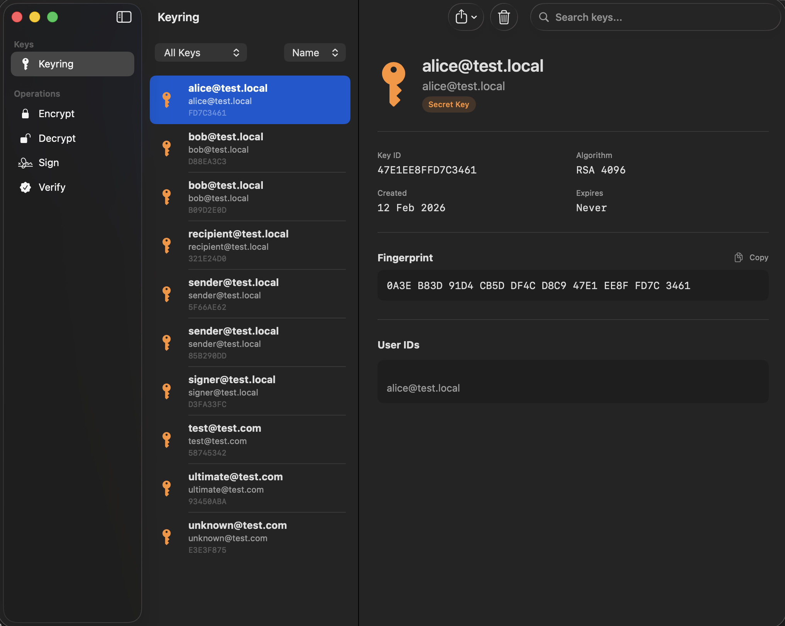

# MacPGP

MacPGP is a native macOS OpenPGP app for managing keys, encrypting files and messages, signing content, and working with encrypted files directly from Finder.

## Installation

MacPGP is distributed through the Mac App Store.

- Requires macOS Tahoe 26.2 or later
- Apple Silicon is recommended. The current vendored OpenPGP bridge is `arm64`-only, so Intel Macs are not a supported build target.
- Mac App Store: App Store link will be added at launch
- Release notes: [CHANGELOG.md](CHANGELOG.md)

## What MacPGP Does

- Generate RSA keys in 2048, 3072, or 4096 bits
- Import, export, and delete OpenPGP public and private keys
- Encrypt messages and files for one or more recipients
- Decrypt supported OpenPGP messages and files
- Sign messages and files
- Verify signatures when the relevant public key is available
- Work with ASCII-armored keys, messages, and signatures
- Store passphrases in macOS Keychain for supported workflows
- Preserve in-progress workflow state as you move through the app

## Finder Integration

MacPGP integrates with Finder through three shipping macOS extensions:

- **FinderSyncExtension** - Adds badges for supported encrypted files and Finder context menu actions for supported MacPGP workflows
- **QuickLookExtension** - Provides metadata previews for supported encrypted files and supports in-preview decryption when the required keys are available
- **ThumbnailExtension** - Provides custom thumbnails for supported encrypted files

**Enabling Extensions:**
After first launch, enable the shipping extensions in System Settings → Privacy & Security → Extensions → Finder Extensions / Quick Look / Thumbnails.

## For Developers

Development setup and build instructions are in [DEVELOPMENT.md](DEVELOPMENT.md).

## Support

- Support page: [MacPGP Support](https://thalesmms.github.io/MacPGP-app/support.html)
- Privacy policy: [MacPGP Privacy Policy](https://thalesmms.github.io/MacPGP-app/privacy.html)

## Keyboard Shortcuts

| Action | Shortcut |
|--------|----------|
| Generate New Key | ⌘N |
| Import Key | ⌘I |

## License

Apache License 2.0 - see [LICENSE](LICENSE) for details. Third-party notices for
the vendored OpenPGP bridge are in [THIRD_PARTY_NOTICES.md](THIRD_PARTY_NOTICES.md).

## Privacy

MacPGP public support and privacy information is available on the GitHub Pages
site:

- Website: [MacPGP Website](https://thalesmms.github.io/MacPGP-app/)
- Privacy Policy: [MacPGP Privacy Policy](https://thalesmms.github.io/MacPGP-app/privacy.html)
